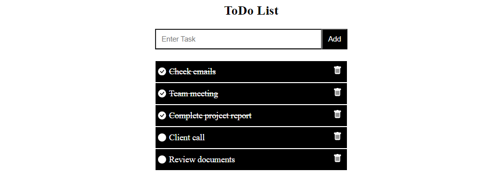

# ToDoList

## Introduction

This is a MERN stack project. MERN stands for MongoDB, Express.js, React, and Node.js. This project demonstrates a full-stack application with a frontend built using React and a backend using Node.js, Express.js, and MongoDB.

### Technologies Used: 
  - Frontend: React
  - Backend: Node js / Express js
  - Database: MongoDB
    
### How to Run 
#### Frontend
- Install the dependencies: `npm install`
- Start the development server: `npm run dev`
- Open your browser and visit: `http://localhost:3000`
#### Backend
- Install the dependencies: `npm install`
- Start the development server: `npm start`

## License

This project is licensed under the MIT License - see the [LICENSE](LICENSE) file for details.
